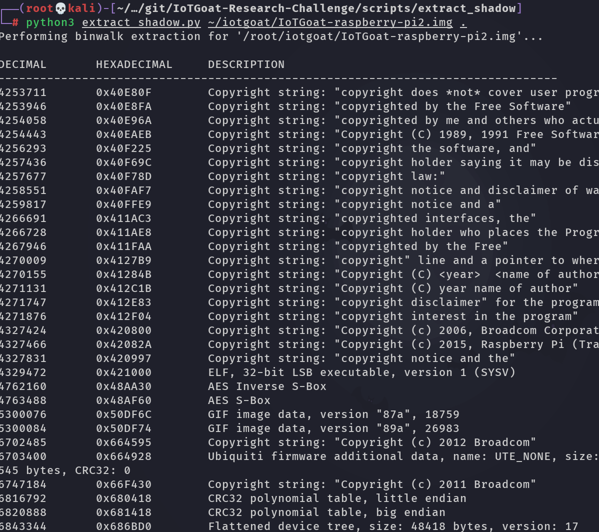
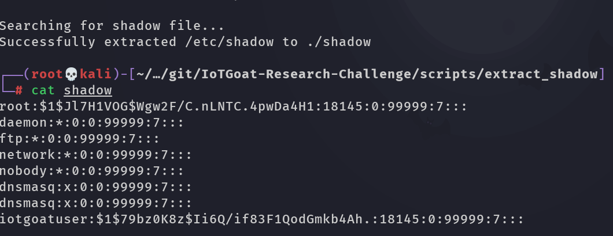

# Binwalk Shadow Extractor

The Binwalk Shadow Extractor is a Python script that automates the extraction of a binary file using Binwalk and attempts to locate a shadow file within it. It simplifies the process of extracting and locating sensitive files, such as the `/etc/shadow` file in Linux systems, from binary images.

## Requirements

- Python 3.x
- Binwalk

## Installation

1. Clone this repository:

   ```shell
   git clone https://github.com/your-username/binwalk-shadow-extractor.git
   cd binwalk-shadow-extractor
   ```

2. Ensure that `binwalk` is installed on your system. If not, you can install it using the package manager of your operating system.

## Usage

To extract a binary file and search for a shadow file using the Binwalk Shadow Extractor, use the following command:

```shell
python3 extract_shadow.py <image_path> <output_dir>
```

- `<image_path>`: Path to the binary image file.
- `<output_dir>`: Directory where the extracted shadow file will be saved.

The script will perform the following steps:

1. Verify the existence of the image file.
2. Perform a Binwalk extraction on the image file using the `binwalk -e --run-as=root` command.
3. Search for the extracted directory with the `.extracted` extension in the current working directory.
4. Recursively search for the shadow file within the extracted directory.
5. If a shadow file is found, copy it to the specified output directory.

Note: The script assumes that the `binwalk` command is available in the system's PATH.

## Example

To extract the shadow file from a binary image called `firmware.bin` and save it to the current directory, run the following command:

```shell
python3 extract_shadow.py firmware.bin .
```




## Limitations

- The script assumes that the shadow file is located in the `/etc` directory of the extracted file system. If the file is stored in a different location or with a different name, the script may not find it.
- The script only supports Linux file systems. It may not work correctly with other file systems.
